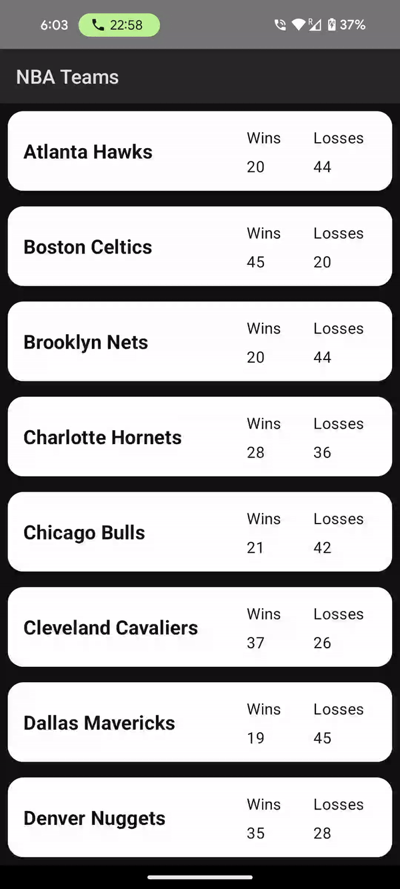
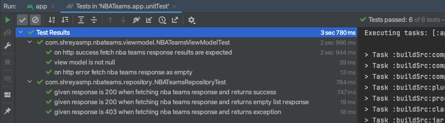

# NBATeams-MVVM-Compose-Retrofit-Koin-Kotlin_DSL_withTests

# This is a MVVM Android App developed using some of latest Android libraries as of 2023/24

1. Model-View-ViewModel architecture
2. Koin for Dependency Injection
3. Retrofit for Service with Gson
4. Kotlin for development
5. Kotlin DSL for project setup
6. Coroutines for viewModel handling of async and non-blocking programming.
7. Jetpack Compose for Card Item and LazyColum which is recyclerView in Compose World.
8. Mockito/Espresso/extJunit/Robolectric for unit testing and android tests for viewmodel, views
9. OKHttp Interceptor/Mockserver for logging service responses on Logcat and creating mock server
    for testing Repository
10. Room Db for cache implementation for retrieved response in case network is lost

Here's the video of how the app works and looks like.

Android App to display the list of NBA teams with wins/loss and on tapping on each list item
Take user to detailed screen with the same selected team stats but with list of players now.

